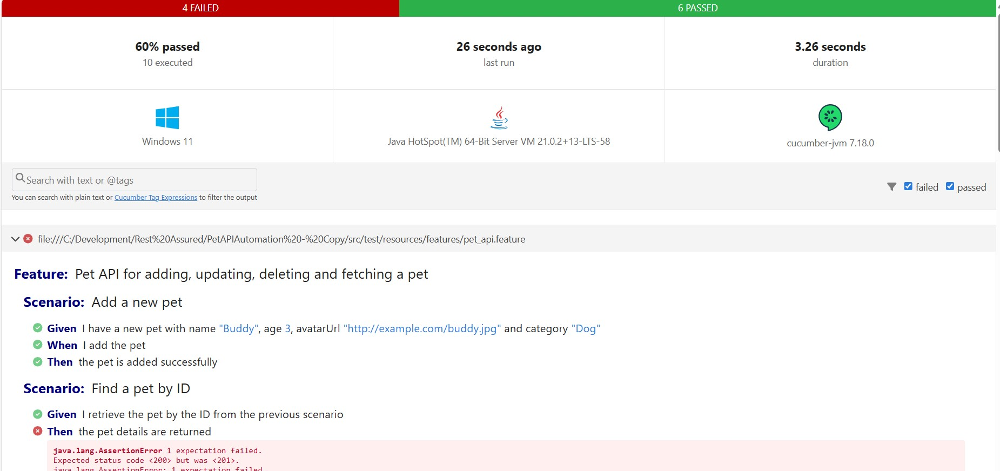

# Pet API Automation Testing

This project is a Cucumber-based test automation suite for testing the Pet API. It includes scenarios for adding, updating, deleting, and fetching pets. The project uses RestAssured for API interaction and JUnit for running the tests.

### Project Structure

 - Feature Files: Located in src/test/resources/features
 - Step Definitions: Located in src/test/java/petapi/stepDefinitions
 - Test Runner: Located in src/test/java/petapi/testRunners
 - Data Models: Located in src/test/java/petapi/setData

### PreRequisites

 - Java 8 or Higher
 - Maven

### Setup

 - Clone the repository

```
    git clone https://github.com/iperceiveit/PetAPIAutomation/
    cd pet-api-automation
```
 - Install dependencies
```
    mvn clean install
```

### Running the tests

1. Execute tests using Maven
``` 
mvn clean verify
```
2. Executed test using Test Runner

```
Go to folder src->test->java->testRunners
Right click TestRunner.java and select Run 'TestRunner'
```
### Viewing the cucumber reports

Navigate to target/cucumber-reports.html and sample report is as below and also its available in [this](report/cucumber-reports.html) location



### Test Scenarios and implementation details

Since the pet API is either not fully implemented or the Swagger API specification is incorrect, I have implemented the test scenarios in such a way that they are intended to behave accordingly

### Scenario 1

 **Add a new pet**

        Scenario description: Add a new pet with resource the below

        resource path - /pet

        body fields - name, age, avatarUrl, category

        expected status - 201

        API Implemented status - 201

### Scenario 2

 **Find a pet by ID**

        Scenario description: retrive the created resource

        resource path - /pet

        body fields - name, age, avatarUrl, category

        expected status - 200

        API Implemented status - 201

### Scenario 3

**Update an existing pet**

        Scenario description: update the already created resource

        resource path - /pet/{petid}

        body fields - name, age, avatarUrl, category

        expected status - 200

        API Implemented status - 200


### Scenario 4

**Delete a pet**

        Scenario description: Delete the already created resource

        resource path - /pet/{petid}/remove

        body fields - name, age, avatarUrl, category

        expected status - 200

        API Implemented status - 200
        Expected Method - Delete
        
        Implemented Method - Post


### Scenario 5

**Add a new pet only with mandatory details**

        Scenario description: Adding a pet with only name and age

        resource path - /pet/

        body fields - name, age

        expected status - 201

        API Implemented status - 201

### Scenario 6

**Negative - Try to update, delete or retrieve a pet with invalid pet id or details**

        Scenario description: Try to perfom the operation either with invalid id or invalid details

        resource path - /pet/{petid}

        body fields - various missing details

        expected status - Update - 400
                          Delete - 404
                          Retrieve - 404

        API Implemented status - 400

### Scenario 7

**Try adding a new pet without a mandatory field**

        Scenario description: Adding a pet without only name or age

        resource path - /pet/

        body fields - age

        expected status - 422

        API Implemented status - 400

### Scenario 8

**Try update the pet without a mandatory field**

        Scenario description: Update the pet resource with out age

        resource path - /pet/{petid}

        body fields - name

        expected status - 400

        API Implemented status - 400

